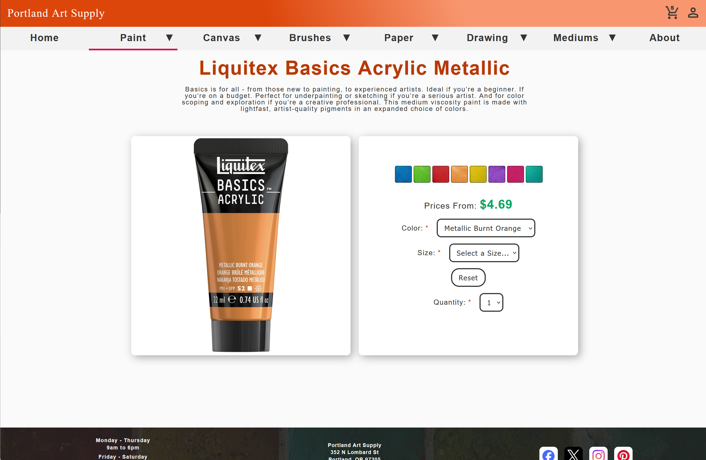
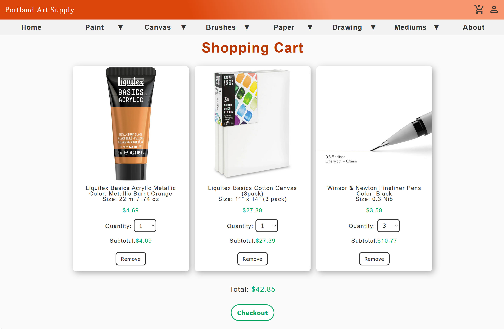

# Portland Art Supply

Portland Art Supply (PAS) is a fictional e-commerce site. 

Visit the site at https://portland-art-supply.bdtripp.com/  

To view an ERD of the PAS database, visit my portfolio site at https://bdtripp.com/#projects . Click on the “View Details” button for PAS. Then click on the document icon to the right of “Data Modeling”.  

Note: This is a demo site. A production version would include checkout (shipping + payment) and an admin interface for managing products. 

---

## Demo

A quick walkthrough of browsing products, selecting options, and updating the shopping cart:

---

## Screenshots

 

---

## Features
- View products by category, subcategory, and product group.
- View products along with their description, color and size options, and price.
- Add and delete products in the shopping cart and the quantity, sub-total, and total purchase amounts will be adjusted accordingly.
- Create an account to automatically save shopping cart history

---

## Technical Highlights

- Designed a nine‑table relational database for category, product, and user account data. 
- Implemented dynamic drop-down lists for product color and size options using multi-JOIN queries.
- Used AJAX to provide real-time updates to shopping cart quantities and totals.
- Stored PHP sessions in the database so the shopping cart is restored when the user logs in.

---

## Tech Stack

- Languages: HTML5, CSS3, JavaScript, PHP
- Database: MySQL
- DevOps / Workflow: Docker, Dev Container, GitHub Actions

---

## Code Highlights

- **Database access**  
  The lookup_items function in [`includes/db_code.php`](includes/db_code.php) uses a multi-JOIN SQL query to retrieve all products within a particular product group from the database.

- **UI generation**  
  The show_items_in_cart function in [`includes/ui_code.php`](includes/ui_code.php) is responsible for dynamically generating the shopping cart interface.

- **Dynamic product options**  
  The createDropDown function in [`public/js/pas.js.php`](public/js/pas.js.php) generates the color and size dropdowns and updates the UI based on user selections.

---

## Images

**Folder Structure/Organization:**

Images are organized by category and subcategory folders.

- Category folders contain multiple subcategories
- Subcategory folders contain images of all products in that subcategory
- Three types of images
  - General product image
  - Specific product image for a particular color and size
  - Color thumbnail
- The category, subcategory, group code, color, and size are stored in the database for each product. The data is retrieved from the database and used to generate the `src` attribute for each `` tag. (see displayItemImage function in [`includes/ui_code.php`](includes/ui_code.php))  

**Naming convention for the images:**

General product image: &nbsp;&nbsp;&nbsp;&nbsp;groupcode.jpg

Specific product image: &nbsp;&nbsp;&nbsp;&nbsp;groupcode-colorname-sizedescription.jpg

Color thumbnail: &nbsp;&nbsp;&nbsp;&nbsp;groupcode-tn-colorname.jpg

Note: There will always be a “general product image”. Some products will not have a “specific product image” or a “color thumbnail”.  

**Image Files and Folders Example:**

Category Folder: Paint  
&nbsp;&nbsp;&nbsp;&nbsp;Subcategory Folder: Oil  
&nbsp;&nbsp;&nbsp;&nbsp;&nbsp;&nbsp;&nbsp;&nbsp; winsor-newton-artists-oil.jpg &nbsp;&nbsp;&nbsp;&nbsp; <- groupcode  
&nbsp;&nbsp;&nbsp;&nbsp;&nbsp;&nbsp;&nbsp;&nbsp; winsor-newton-artists-oil-alizarin-crimson-37-ml-_-1_25-oz.jpg &nbsp;&nbsp;&nbsp;&nbsp; <- groupcode-colorname-sizedescription

&nbsp;&nbsp;&nbsp;&nbsp; Subcategory Folder: Oil Color Thumbnails  
&nbsp;&nbsp;&nbsp;&nbsp;&nbsp;&nbsp;&nbsp;&nbsp; winsor-newton-artists-oil-tn-alizarin-crimson.jpg &nbsp;&nbsp;&nbsp;&nbsp; <- groupcode-tn-colorname
